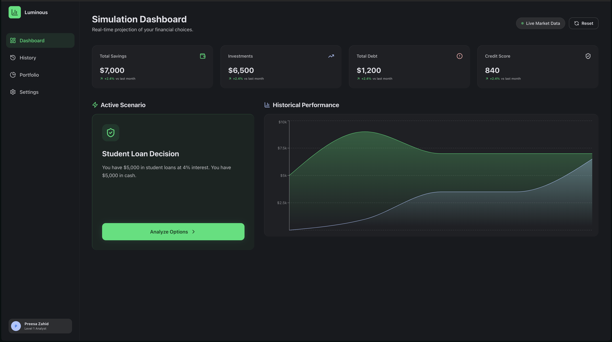
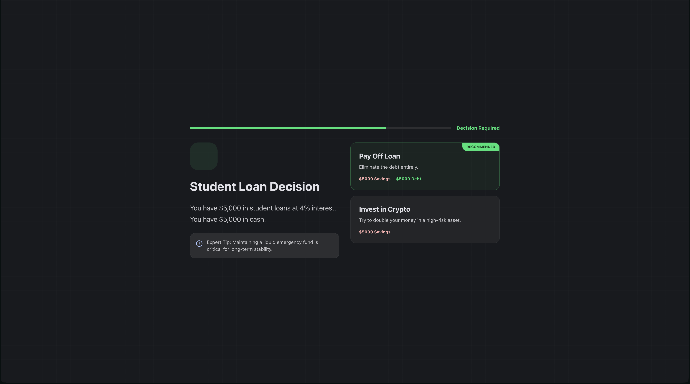
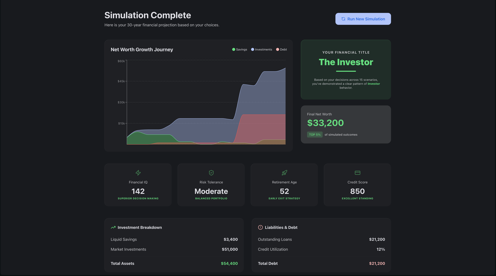

# 🌟 Luminous Ledger – Financial Simulation System

## 📌 Project Title

**Luminous Ledger – Financial Simulation System**

---

# 🧩 Problem Statement

Many individuals struggle to understand real-world financial decision-making. Traditional budgeting tools lack interactive learning, and users cannot safely experiment with financial scenarios like job loss, investments, emergencies, or debt management.

There is a need for an **interactive financial simulator** that helps users learn money management through realistic scenarios and AI-driven feedback.

---

# 💡 Solution

Luminous Ledger is an **interactive financial life simulation system** that presents users with real-world financial scenarios. Users make decisions, and the system dynamically updates their financial status including savings, income, expenses, and risk level.

The platform simulates:

* Emergency expenses
* Investment decisions
* Lifestyle choices
* Debt management
* Career changes
* Financial planning

Users learn financial literacy by **playing through life scenarios**.

---

# ✨ Features

### 🎮 Financial Simulation Engine

* Scenario-based decision system
* Multiple-choice financial decisions
* Dynamic balance updates
* Risk score tracking

### 📊 Real-Time Financial Dashboard

* Savings tracking
* Income vs expenses
* Risk level indicator
* Progress summary

### 🧠 Smart Decision Logic

* Each choice affects financial future
* Long-term consequences
* Realistic outcomes

### 🔄 Game Flow

* Start simulation
* Answer scenarios
* View financial result
* Restart simulation

### 🎯 Learning Focus

* Financial literacy
* Budget planning
* Emergency readiness
* Investment awareness

---

# 🛠 Tech Stack

### Frontend

* React
* TypeScript
* Vite
* CSS

### State Management

* React Hooks
* Local State

### Development Tools

* Vite Dev Server
* TypeScript Compiler
* ESLint (optional)

### Version Control

* Git
* GitHub

---

# 🎥 Demo (Video Link)

Add your demo video here:

```
https://your-demo-video-link.com
```

Example:

* Loom recording
* YouTube demo
* Screen recording

---

# 📸 Screenshots

## Dashboard

```
## Dashboard

```

## Scenario Screen

```
## Scenario Screen


```

## Result Screen

```
## Result Screen

```

## Decision Simulation

```
Add screenshot here
```

---

# 🚀 How to Run

## 1. Clone Repository

```bash
git clone https://github.com/yourusername/luminous-ledger.git
```

---

## 2. Navigate to Project

```bash
cd luminous-ledger
```

---

## 3. Install Dependencies

```bash
npm install
```

---

## 4. Start Development Server

```bash
npm run dev
```

---

## 5. Open in Browser

```
http://localhost:5173
```

---

# 📁 Project Structure

```
src/
 ├── App.tsx
 ├── main.tsx
 ├── constants.ts
 ├── types.ts
 ├── index.css
 └── lib/
     └── utils.ts
```

---

# 🎯 Use Cases

* Financial education
* Student learning tool
* Budget training simulator
* Personal finance practice
* Decision-making training

---

# 🧠 Future Improvements

* AI financial advisor
* Save user progress
* Difficulty levels
* Investment simulator
* Charts & analytics
* Multiplayer comparison

---

# 👨‍💻 Author

Built for financial learning and simulation.

---

# 📄 License

MIT License
